# Asthmatic Gene Expression Data Preprocessing

This project involves the preprocessing of a gene expression dataset related to asthmatic and non-asthmatic individuals. The work includes exploratory data analysis, data filtration, normalization, and summarization to prepare the dataset for further bioinformatics analysis.

## 🧬 Project Overview

Asthma is a chronic respiratory condition that causes inflammation and narrowing of the airways. It affects millions worldwide and is influenced by genetic and environmental factors. This project preprocesses microarray gene expression data to enable accurate downstream analysis.

## 📊 Dataset Details

- **Platform:** GPL570 (Affymetrix Human Genome U133)
- **Accession Number:** GSE35571
- **Organism:** *Homo sapiens*
- **Disease:** Asthma
- **Sample Size:** 131 samples (60 asthmatic, 64 non-asthmatic after filtration)
- **Number of Probes:** 54,662
- **Data Type:** Microarray
- **Dataset Link:** [GSE35571 on NCBI](https://www.ncbi.nlm.nih.gov/sites/GDSbrowser?acc=GDS5000#details)

## 🧪 Steps Performed

### 1. Exploratory Data Analysis (EDA)
- Class distribution visualization before filtration
  
  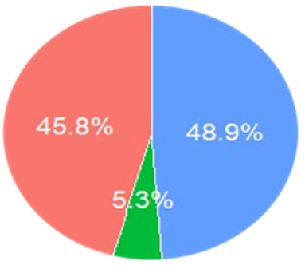
- Boxplot and density plots to examine gene expression levels before Normalization
  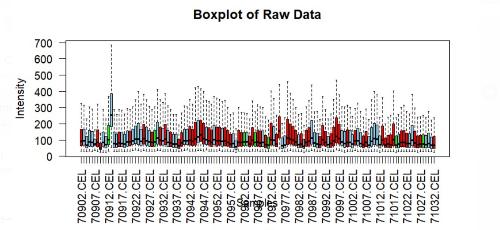
  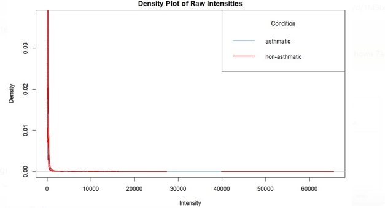
  

### 2. Data Preprocessing
- **Filtration:** Removed samples with missing values

  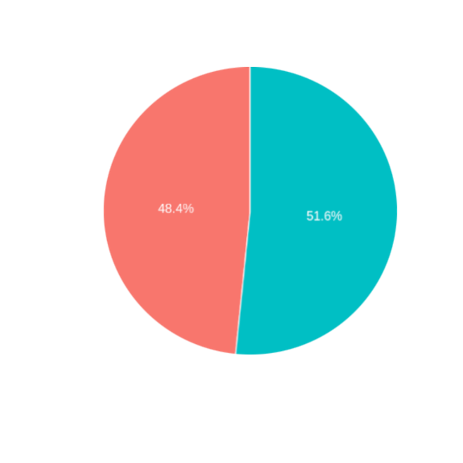
  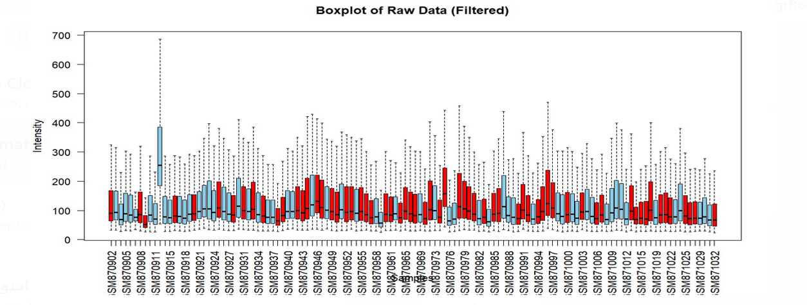
  
- **Quantile Normalization:** Standardized probe intensity distributions across samples
- **Summarization:** Converted probe-level data to gene-level by averaging probe values with the same gene name

### 3. Post-Processing Visualization
- Updated boxplots and density plots after normalization and summarization to confirm data quality improvements
  
  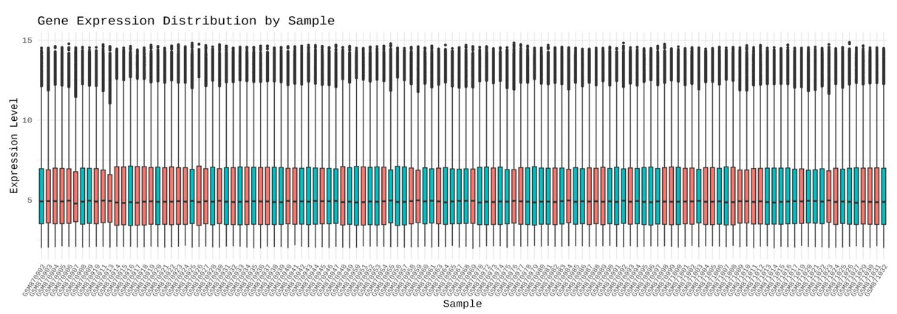
  
  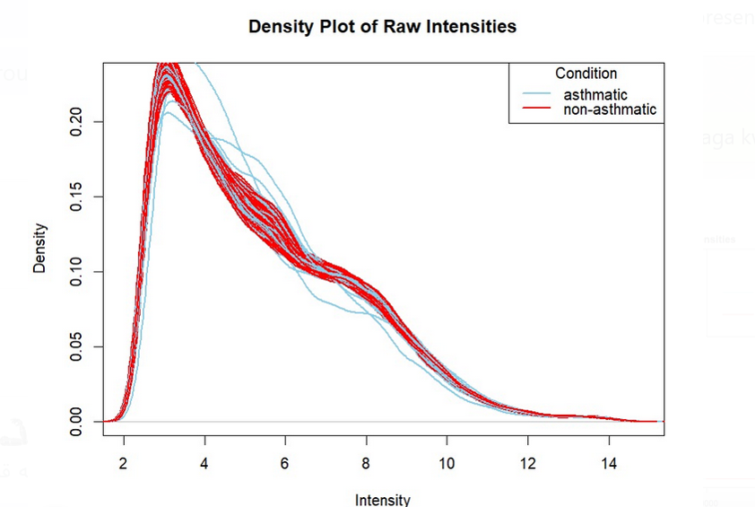

## 🧬 Generalized Preprocessing Pipeline

### 1. Setup and Library Imports
- Load the necessary R libraries for data manipulation, preprocessing, and visualization. These libraries handle data input/output, statistical analysis, and graphical representation.

### 2. Downloading the Dataset
- Download the gene expression dataset from a public repository, such as the Gene Expression Omnibus (GEO), or from a local file source.
- Load the dataset into R as an expression set for further processing.

### 3. Extracting and Decompressing Raw Data
- If the dataset comes in a compressed format (e.g., `.tar`), extract the raw data files (such as **.CEL** files) from the archive.

### 4. Gunzip and List CEL Files
- If the raw data files are compressed (e.g., `.gz`), decompress them to access the original **.CEL** files.
- List the **.CEL** files for further analysis and ensure they are ready for processing.

### 5. Reading Raw Expression Data
- Read the **.CEL** files into R using appropriate functions for microarray data.
- Extract both the raw intensity values (expression data) and the corresponding phenotype data (sample information) for analysis.

### 6. Matching Phenotype Data with Expression Data
- Ensure that the phenotype data (which contains information about the samples, such as disease status or treatment group) matches the samples in the gene expression data.
- Reformat and align the data correctly to make sure it is ready for analysis.

### 7. Visualizing Raw Data
- Create an initial visualization (e.g., boxplot) to explore the raw intensity values across the samples.
- Color the plot based on key attributes, such as disease status or sample group.

### 8. Filtering Out Unwanted Samples
- Filter out any samples that have missing or irrelevant data (e.g., N/A values in the phenotype data) to ensure the analysis is based only on relevant samples.

### 9. Visualizing Filtered Data
- After filtering out unwanted samples, create another visualization (e.g., boxplot) to assess the distribution of the expression data in the cleaned dataset.

### 10. Background Correction and Normalization
- Apply background correction methods (e.g., **RMA** or other techniques) to adjust for systematic noise in the raw data.
- Normalize the expression data to ensure consistency in the intensity values across samples.

### 11. Summarizing Data Using Statistical Methods
- Use appropriate summarization techniques, such as **median polish**, to aggregate the expression data for each probe or gene across samples.

### 12. Visualizing Normalized Data
- Create a final visualization (e.g., boxplot) of the normalized expression data to inspect the results after background correction and normalization.

---

### 13. Additional Gene Expression Analysis

In addition to preprocessing, the following steps were performed to further analyze the cleaned gene expression data:

#### A. Data Import and Transformation

- **Reading the Data:** The cleaned gene expression data is imported from a CSV file into R. The data is converted to a numeric matrix for analysis.

- **Log2 Transformation:** The expression values are log-transformed (log2) to reduce the impact of outliers and make the data more suitable for statistical modeling.

#### B. Grouping and Plotting

- **Group Labeling:** The dataset is grouped based on disease status (asthmatic vs. non-asthmatic).
- **Boxplot Visualization:** A boxplot is generated to visualize the distribution of the log-transformed expression values across the samples, with color differentiation based on the disease status.
   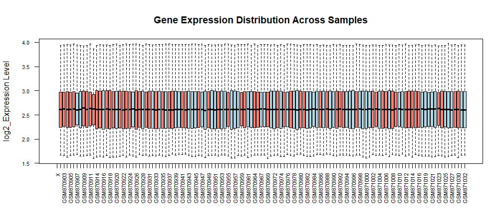

#### C. Statistical Analysis

- **T-Test:** A t-test is performed for each gene to identify significant differences between the two groups (asthmatic vs. non-asthmatic).
- **Multiple Testing Correction:** The p-values are adjusted for multiple comparisons using the Benjamini-Hochberg (BH) method.
  
 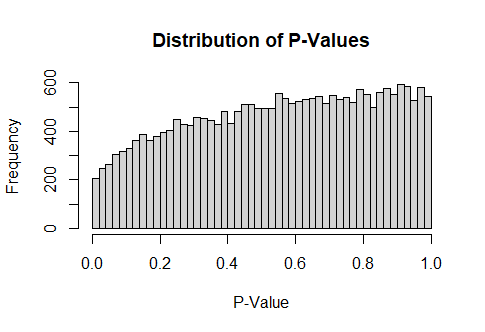
 
#### D. Differential Gene Expression

- **Log2 Fold Change (log2FC):** Log2 fold changes are calculated to measure the magnitude of change in expression between the two groups.
  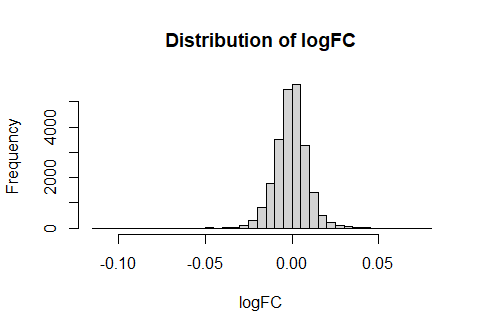
 
- **Limma Analysis:** The **limma** package is used to fit a linear model to the expression data and perform eBayes moderated t-tests to identify differentially expressed genes.
- **Volcano Plot:** A volcano plot is generated to visualize the results of the differential expression analysis, highlighting upregulated, downregulated, and non-significant genes.
  
  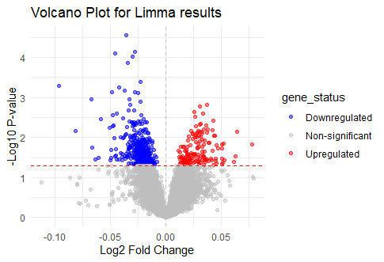
 

#### E. Results Export

- **Export Results:** The final results, including differential expression statistics, are written to a CSV file for further analysis or reporting.

## 📈 Results

- Improved consistency and comparability across samples
- Reduced technical noise and redundancy
- Prepared a clean gene-level dataset suitable for further statistical or machine learning analysis
- Identification of differentially expressed genes between asthmatic and non-asthmatic groups

## 👩‍💻 Contributors

- Aliaa Alaa Eldin  
- Kholoud Abdelmohsen  
- Roaa Ashraf  
- Salma Sameh  
- Shada Gamal

**Supervisor:** Dr. Rana Hossam Elden  
**Engineer:** Eng. Heidi Ahmed   

**Helwan university - Faculty of engineering**
